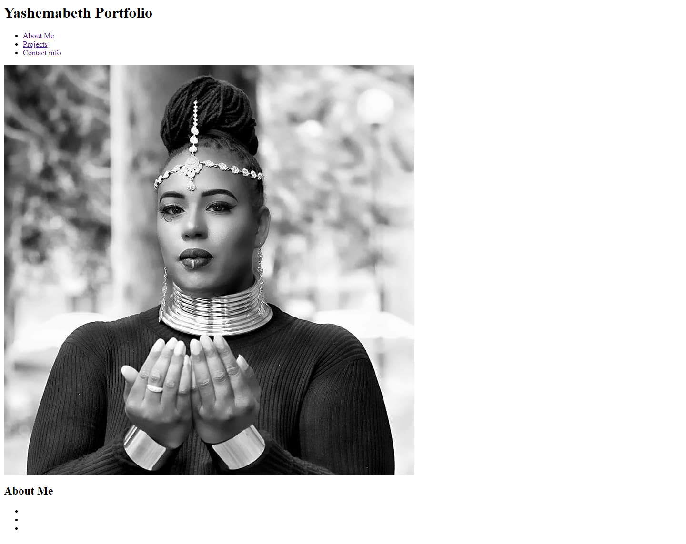
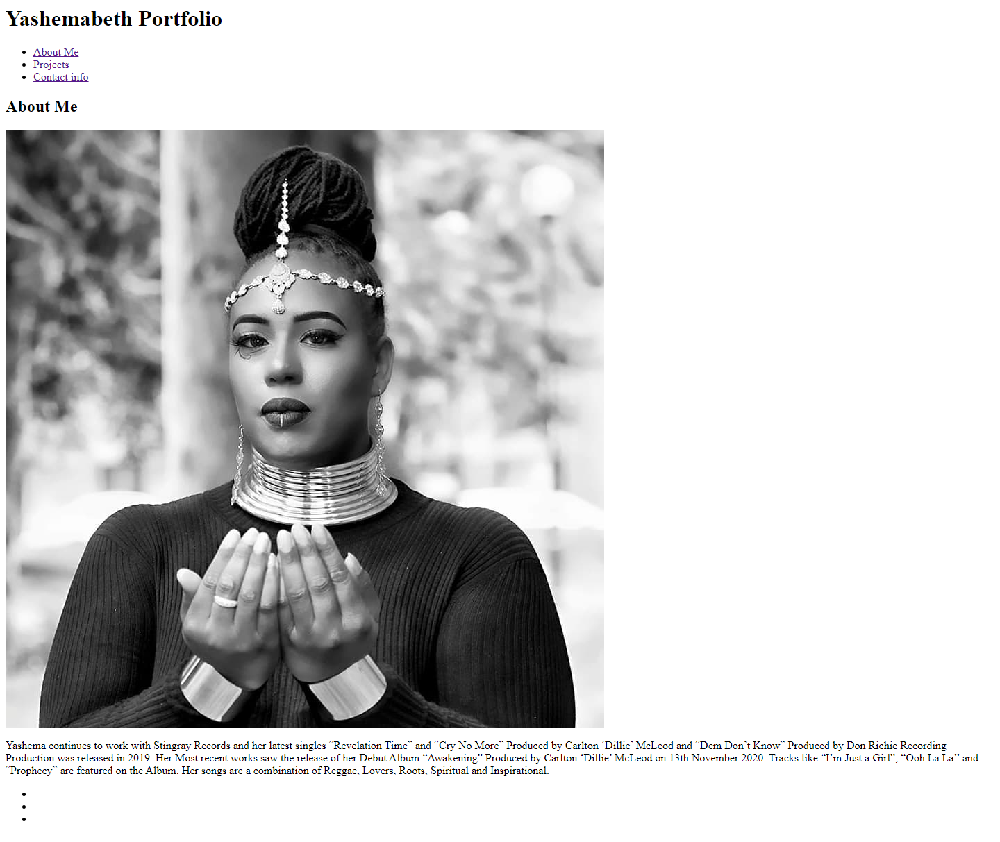
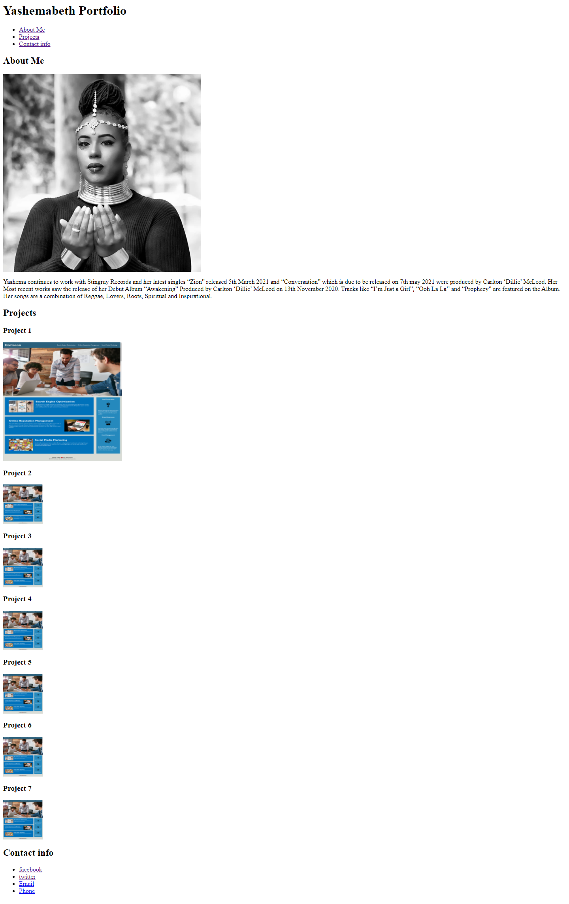
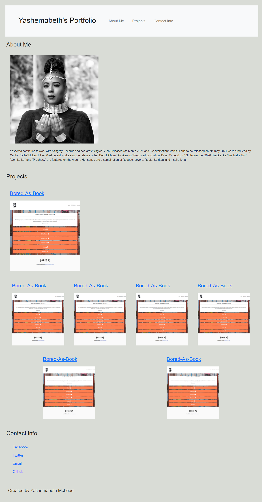
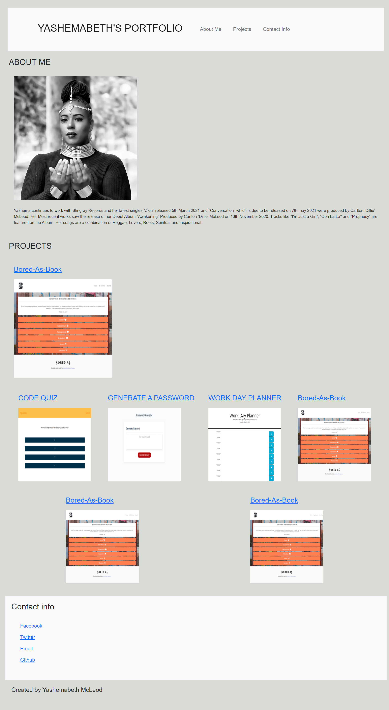
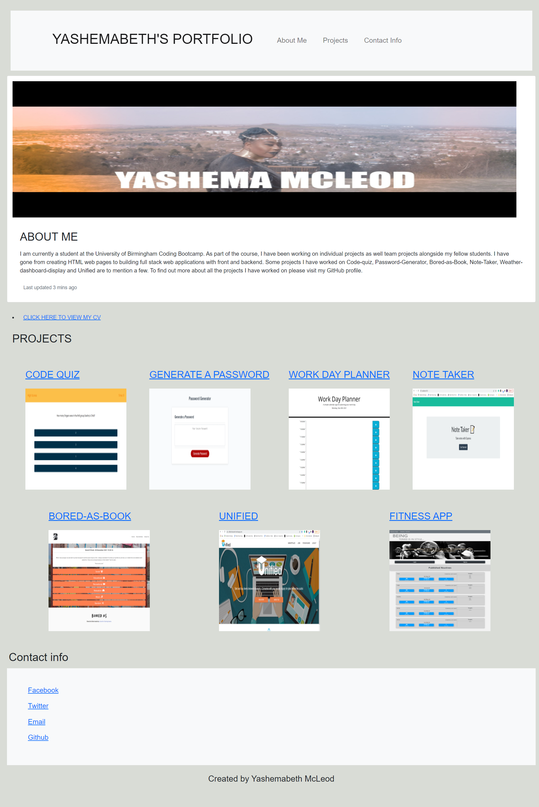
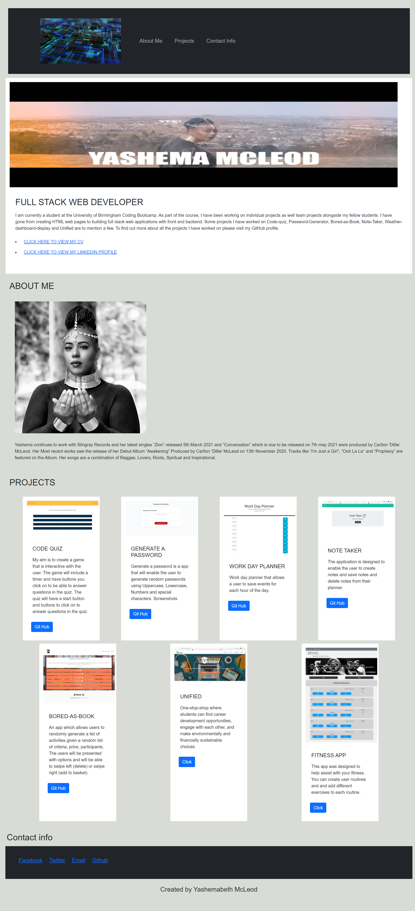
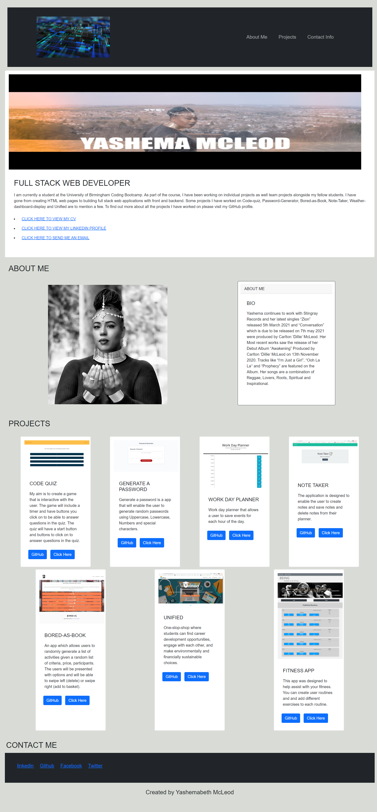

# Yashemabeth-Portfolio

A portfolio page displaying projects.

## Description

The aim of this project was to create my own web page. The page needs to have css styles, Flex boxes and Media Queries. The page must have sections. About me, My Projects and contact info. The page must display images of my recent project and an image of myself. it should have navigation functions

## Screenshots

### Homework week 2

- Image of webpage
  

- Image work in progress
  

- Image throughout changes
  

- Final
  

### Homework week 8

- Images of webpage
  

- Image-work in progress
  

### Homework week 16

- Image work in progress
  

- Image throughout changes
  

- Final
  

### Link to github repository

https://github.com/Yashemabeth/yashemabeth-portfolio

### Link to deployed application

Website
https://Yashemabeth.github.io/yashemabeth-portfolio/
