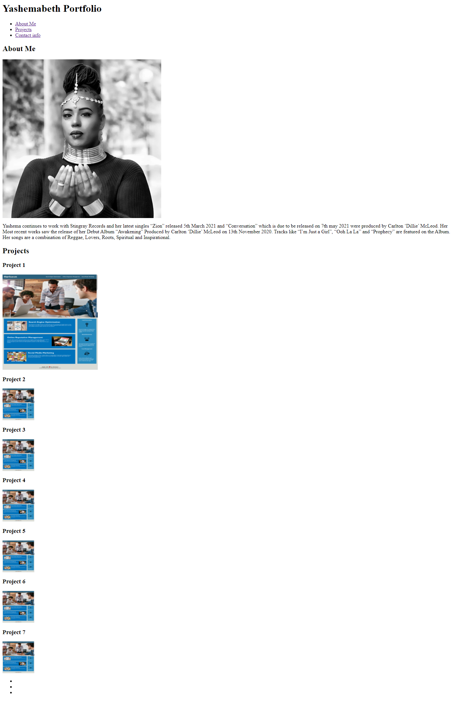

# Yashemabeth-Portfolio

A portfolio page displaying projects.

## Description

The aim of this project was to create my own web page. The page needs to have css styles, Flex boxes and Media Queries. The page must have sections. About me, My Projects and contact info. The page must display images of my recent project and an image of myself. it should have navigation functions

## Screenshots

- Image before -Week 1

  

- Image changes
  

- Images throughout changes
  

- Image changes
  

- Images After changes - Week 8
  

- Images After changes
  

### Link to github repository

https://github.com/Yashemabeth/yashemabeth-portfolio

### Link to deployed application

Website
https://Yashemabeth.github.io/yashemabeth-portfolio/
